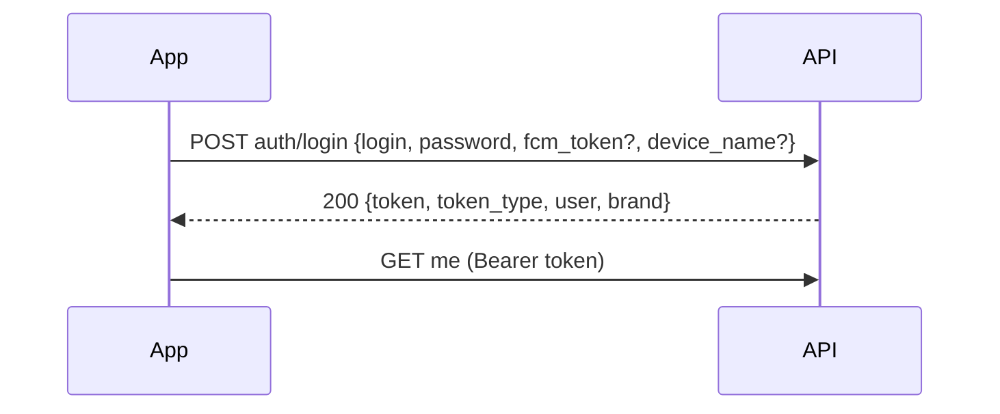
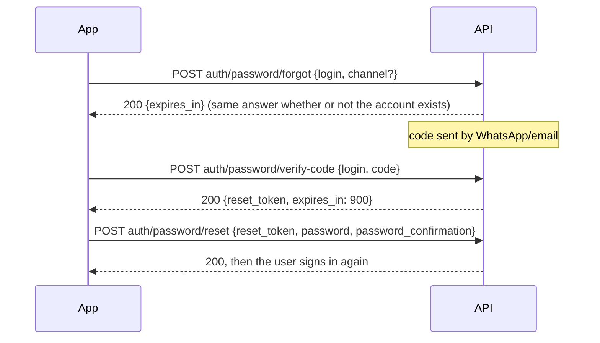

# Atombrand: Product, Architecture, Design & API

> **What this is:** the single reference for building **Atombrand**, the Brand Partner mobile app (Flutter). It covers what the app is for (PRD), how it fits the backend (architecture), how it should look (design), and the complete API contract.
> **Backend status:** API built and tested (`routes/api/brand-app.php`, `tests/Feature/BrandAppApiTest.php`).
> **Build brief:** `docs/BRAND_APP_BUILD_PROMPT.md`, a ready-to-paste prompt for the Flutter build.
> **Web twin:** the Brand Partner portal at `/brand-portal`. The app does the same jobs with the same rules. When in doubt, the portal's behaviour is the reference.
> Last updated: 2026-10-01

---

## Contents

1. [Product requirements (PRD)](#1-product-requirements-prd)
2. [Business rules the app must respect](#2-business-rules-the-app-must-respect)
3. [Screens & navigation](#3-screens--navigation)
4. [Design system](#4-design-system)
5. [App architecture (Flutter)](#5-app-architecture-flutter)
6. [Authentication flows](#6-authentication-flows)
7. [API conventions](#7-api-conventions)
8. [API reference](#8-api-reference)
9. [Backend architecture](#9-backend-architecture)
10. [Testing, environments & release checklist](#10-testing-environments--release-checklist)
11. [Open questions / future work](#11-open-questions--future-work)

---

## 1. Product requirements (PRD)

### 1.1 Who it is for

A **Brand Partner** is a manufacturer or official distributor (e.g. a phone or TV brand) that sells its catalogue on AtomShop.pk. Each partner has **one login linked to one brand** (`users.role = 'brand'`, `brands.user_id`). AtomShop creates the account; brands do not self-register.

| Persona | Typical user | What they need on mobile |
|---|---|---|
| Brand owner / manager | Owner, sales head | Daily glance at orders and demand, approve/cancel cash orders, reply to bulk enquiries fast |
| Brand ops / warehouse | Stock keeper | Mark products in/out of stock, set unit counts, mark orders delivered with proof photo |
| Brand marketing | Marketing exec | Update the public brand page (logo, banner, slides, story), feature products |

### 1.2 Problem

Brand partners today must open the web portal on a laptop to see new orders and bulk enquiries. Bulk enquiries are time-sensitive (the first brand to call wins the deal), and delivery proof is taken on a phone anyway. The app puts these jobs in their pocket, with push-ready plumbing.

### 1.3 Goals

1. **Respond faster:** a brand sees a new bulk request or order and acts on it in under a minute.
2. **Keep stock truthful:** out-of-stock products are flagged from the shop floor, not the office.
3. **Proof of delivery:** delivery photos captured in-app and attached to the order history.
4. **Self-serve brand page:** the public brand storefront can be updated without emailing AtomShop.

### 1.4 Non-goals (v1)

- **Financing.** Brands never create instalment plans, collect instalments, or edit seller-sourced deals. They can only *view* them.
- **Publishing.** A brand cannot make its own product live; AtomShop reviews every new product and every edit to a live product.
- **Self-registration.** New brands *apply*; AtomShop approves and creates the login.
- **Changing the brand slug** (public URL) or homepage placement. Admin only.
- Chat, payouts/settlements, and analytics beyond the dashboard (see §11).

### 1.5 Feature list (v1)

| # | Feature | API | Notes |
|---|---|---|---|
| F1 | Sign in with email **or** phone + password | `auth/login` | Token straight away; **no code at login** |
| F2 | Forgot password (code by WhatsApp/email) | `auth/password/forgot` → `auth/password/verify-code` → `auth/password/reset` | The only place an existing account gets a code |
| F3 | Sign out | `auth/logout` | Revokes this device's token |
| F4 | Apply to become a partner (with phone code) | `apply/otp/send`, `apply` | Creates a `brand_partners` application for AtomShop to review |
| F5 | Dashboard | `dashboard` | Catalogue, orders, open bulk requests, top products, latest orders |
| F6 | Products: list, view, create, edit, delete, feature, remove gallery image | `products/*` | New products are always `Pending` |
| F7 | Inventory: in/out of stock + unit count | `inventory/*` | Only for live (`Published` / `Out of Stock`) products |
| F8 | Orders: storefront (retail) + seller-sourced (instalment) | `orders/*` | Only **cash** retail orders are actionable |
| F9 | Bulk requests: list by status, dossier, update status + comment | `bulk-orders/*` | The brand's own leads |
| F10 | Brand page editor | `page`, `page/update` | Logo, banner, story, contacts, up to 2 promo slides |
| F11 | Profile & password | `profile/*` | Changing password signs out other devices |
| F12 | Notifications: inbox + push for new orders, new bulk requests, product review decisions | `fcm-token`, `notifications/*` | See §8.10 |

### 1.6 Success metrics

- Median time from bulk request created → first status change (target: < 2 h, from ~1 day on web).
- Share of cash orders marked *Delivered* with a photo (target: > 80%).
- Weekly active brand partners on mobile / total active partners.
- Out-of-stock orders cancelled for "product unavailable" (should fall).

---

## 2. Business rules the app must respect

The server enforces all of these. The app should *also* hide or disable the controls so users aren't offered actions that will be refused.

### 2.1 Products
- A new product is created as **`Pending`** ("In review"). The brand can never set `status` directly.
- Editing a **`Published`** product sends it back to **`Pending`** for review. Warn the user before saving.
- Editing an **`Out of Stock`** product keeps it out of stock.
- A product that has **ever been ordered cannot be deleted** (`409`). Offer "Mark out of stock" instead.
- `min_advance_price` must be ≤ `price`. Both are whole rupees (integers).
- **Variants are category-gated** (from `products/form-options` → `variant_categories`):
  - colours: categories `[1, 2, 3]`
  - memory (storage) with per-variant price: `[1, 2]` (phones, tablets)
  - sizes with per-variant price: `[4]` (Smart TVs)
  Variants sent for any other category are silently ignored, so only show the matching section.
- Images: jpg/jpeg/png/webp, ≤ 4 MB each; main picture required on create; up to 8 gallery images per upload.

### 2.2 Inventory
- Only `Published` and `Out of Stock` products can be toggled (`can_manage_stock: true`). Others answer `409`.
- Available ⇒ `Published` + a stock count ≥ 1 (required). Not available ⇒ `Out of Stock`, stock 0. Applies **immediately**.

### 2.3 Orders
Two feeds, selected by `type`:

| Feed | Source | Brand can… |
|---|---|---|
| `retail` | Storefront checkouts of the brand's products | **Cash orders** (`is_cash: true`, advance ≥ total): move through statuses. **Financed orders**: read only. |
| `instalment` | Seller-sourced deals in a seller's book | Read only, always |

- Status flow: `Pending → Varification → Processing → Delivered → Completed`, or `Cancelled` from any non-final state.
  ⚠️ **`Varification` is the real value** (intentional DB spelling). Send it exactly like that; *display* it as "Verification".
- `Instalments` is **never** brand-settable (`422`).
- `Completed` and `Cancelled` are **final**: further changes answer `409`.
- `Completed` requires no unpaid instalments.
- Use the `actions` array on the order detail to render buttons. It's the same set the web portal shows, and an empty array means read-only.
- *Delivered* accepts `recieved_by` (who signed) and a `delivered_pictrue` photo. *Cancelled* accepts `reason` plus three optional flags. (The misspellings `recieved_by` / `pictrue` are the real field names.)

### 2.4 Bulk requests
- Statuses: `New Lead → Contacted → Quoted → Won | Lost`. Any status can be set at any time.
- A request with no status counts as `New Lead`.
- A comment is optional on every update; comments form the request's timeline.
- The dossier shows the requester's **dealings with this brand only**. Never other brands' purchases.

### 2.5 Brand page
- Editable: title, tagline, description (≤ 5000), website, support email/phone, logo (≤ 2 MB), banner (≤ 4 MB), hero intro (≤ 300), up to **2** slides (`tag` ≤ 40, `heading` ≤ 90, `text` ≤ 160).
- A slide with an empty heading is dropped. Sending no slides means "no slides".
- Not editable: slug / public URL, active status, homepage placement.

### 2.6 Money, dates, language
- Money is integer PKR. Display as **`Rs. 30,000`** (thousands separators, no decimals).
- Dates arrive as `YYYY-MM-DD HH:MM:SS` in **Asia/Karachi** time. Display `24 Sep 2026` / `24 Sep 2026, 3:05 PM`.
- English UI for v1. Some server messages (e.g. emails) are bilingual EN/Urdu.

---

## 3. Screens & navigation

### 3.1 Navigation map

```
Splash ─┬─ (token valid) ──────────────► Main (bottom tabs)
        └─ (no token) ─► Welcome
                           ├─ Sign in (password) ───► Main
                           ├─ Forgot password ─► Enter code ─► New password ─► Sign in
                           └─ Become a partner ─► Application form ─► Verify phone ─► Submitted

Main (bottom tabs)
 ├─ Home        Dashboard
 ├─ Orders      Retail | Instalment  ─► Order detail ─► Status sheets (Deliver / Cancel)
 ├─ Bulk        Tabs by status (badge) ─► Request dossier ─► Update status sheet
 ├─ Catalogue   Products | Inventory ─► Product detail ─► Product form
 └─ More        Brand page editor · Profile · Change password · Support · Sign out

App bar (every tab): bell icon with `me.badges.unread_notifications` ─► Notifications ─► tap opens the order / bulk request / product
```

The **Bulk** tab shows a badge with `me.badges.new_bulk_requests` (refresh on app resume and every pull-to-refresh; `GET bulk-orders/count` is the cheap endpoint). The **bell** shows `me.badges.unread_notifications` (`GET notifications/count`); bump it when a push arrives in the foreground.

### 3.2 Screen inventory

| Screen | Data | Primary actions | Empty state |
|---|---|---|---|
| Welcome | `GET config` | Sign in · Become a partner | n/a |
| Sign in | n/a | Email/phone + password, "Forgot password?" | n/a |
| Enter code (forgot password / apply) | `expires_in` (+ masked `destinations` on apply) | 6-box code input, resend (cooldown), switch channel | n/a |
| Dashboard | `GET dashboard` | Tap stat → filtered list; tap order → detail | "No orders yet. Share your brand page" + share link |
| Orders list | `GET orders?type=…&status=…&q=…` | Segment Retail/Instalment, status filter chips, search | "No orders with this status" |
| Order detail | `GET orders/{type}/{uuid}` | Buttons from `actions` | n/a |
| Bulk list | `GET bulk-orders?status=…` (+ `counts`) | Status tabs with counts, search, call / WhatsApp | "No new enquiries. They appear here the moment a buyer asks for a quote." |
| Bulk dossier | `GET bulk-orders/{id}` | Call, WhatsApp, Update status (+comment) | n/a |
| Products list | `GET products?status=…&q=…` | Add product (FAB), status filter | "Add your first product" |
| Product detail | `GET products/{id}` | Edit · Feature on brand page · Delete | n/a |
| Product form | `GET products/form-options` | Save (multipart) | n/a |
| Inventory | `GET inventory?availability=in\|out&q=…` (+ `summary`) | Toggle available, stock stepper | n/a |
| Brand page | `GET page` | Edit sections, preview public page (`brand.public_url`) | n/a |
| Profile | `GET profile` | Edit name/email/phone, change password | n/a |

### 3.3 Key interactions
- **Order status buttons** come from `actions[]`: `{status, label, fields[]}`. If `fields` is non-empty, open a bottom sheet collecting them (photo picker for `delivered_pictrue`; reason + checkboxes for cancel). Otherwise confirm with a dialog.
- **Financed / locked orders** show `locked_reason` in an info banner at the top and no action buttons.
- **Call / WhatsApp** buttons: `tel:` with `phone`; WhatsApp with the server-built `whatsapp` URL (`https://wa.me/92…`).
- **Editing a live product** shows: "Saving sends this product back to AtomShop for review. It will be hidden until approved."
- **Pull-to-refresh** on every list. Infinite scroll using `pagination.last_page`.

---

## 4. Design system

Layout mirrors the Brand Partner web portal (`public/brand/css/style.css`); colours follow the Atombrand logo (red + charcoal on white).

### 4.1 Colour tokens

| Token | Hex | Use |
|---|---|---|
| `primary` | `#BE1E2D` | Primary buttons, active tab, links, FAB, "new" badges |
| `primarySoft` | `#BE1E2D` @ 10% | Selected chips, nav indicator |
| `accent` | `#1B1C1E` | App bar, dark highlights |
| `background` | `#F6F7FB` | Scaffold |
| `surface` | `#FFFFFF` | Cards, sheets |
| `ink` | `#1B1C1E` | Primary text |
| `muted` | `#64748B` | Secondary text, captions |
| `line` | `#E2E8F0` | Dividers, input borders |
| `success` | `#15803D` on `#16A34A` @ 12% | Green badge |
| `warning` | `#B45309` on `#FAA53A` @ 16% | Amber badge |
| `danger` | `#B91C1C` on `#DC2626` @ 10% | Red badge, destructive actions |
| `neutral` | `#64748B` on `#F1F5F9` | Grey badge |

Dark mode: not required for v1. If added, keep `primary`/`accent` and invert surfaces (`#0F172A` / `#1E293B`).

### 4.2 Typography
- **Inter** (Google Fonts): 400 / 500 / 600 / 700.
- Scale: Display 24/700 (dashboard numbers) · Title 18/600 · Body 14/400 · Label 13/500 · Caption 12/400 muted.
- Numbers on stat cards use tabular figures.

### 4.3 Shape & spacing
- Card radius **16**, input/button radius **12**, badge radius **999** (pill).
- 4-pt spacing grid; screen padding 16; card padding 16; gap between cards 12.
- Shadow: `0 2 10 rgba(0,0,0,.06)` on cards only.
- Tap targets ≥ 44×44.

### 4.4 Status badges (identical to web)

| Value | Label shown | Colour |
|---|---|---|
| Order `Pending` | Pending | grey |
| Order `Varification` | **Verification** | amber |
| Order `Processing` | Processing | amber |
| Order `Delivered` | Delivered | blue |
| Order `Instalments` | Instalments | blue |
| Order `Completed` | Completed | green |
| Order `Cancelled` | Cancelled | red |
| Bulk `New Lead` | New Lead | amber |
| Bulk `Contacted` / `Quoted` | same | blue |
| Bulk `Won` | Won | green |
| Bulk `Lost` | Lost | red |
| Product `Published` | **Live** | green |
| Product `Pending` | **In review** | amber |
| Product `Out of Stock` | Out of stock | red |
| Product `On hold` / `Closed` | same | grey |

Badges never wrap. A retail order also gets a payment pill: **"Paid in full"** (blue) when `is_cash`, otherwise **"{tenure}-month plan"** (grey).

### 4.5 Components
- **StatCard:** icon in a soft-tinted circle, big number, caption, optional trend.
- **OrderTile:** product thumb (48), title, variant line, amount, status badge, date.
- **BulkTile:** buyer name, product, quantity, city, status badge, quick call/WhatsApp icons.
- **ProductTile:** thumb, title, PR number, price, status badge, stock count.
- **InfoBanner:** left border info blue `#3D5DAB`, info icon (used for `locked_reason`, review warnings).
- **CodeInput:** 6 boxes, auto-advance, paste support, SMS/WhatsApp autofill where the OS allows.
- **EmptyState:** illustration/icon, one sentence saying what's missing, one action.
- Icons: Material Symbols Rounded (the web uses Bootstrap Icons; pick the closest equivalents).

### 4.6 Accessibility
- Contrast ≥ 4.5:1 for text (all badge pairs above meet this).
- Respect system font scaling up to 130% without clipping.
- Every icon-only button has a semantic label.

---

## 5. App architecture (Flutter)

Recommended structure. It matches the Seller App team's habits but is not mandated by the backend.

### 5.1 Stack
| Concern | Choice |
|---|---|
| State | Riverpod (or Bloc, if the Seller App already uses it, for consistency) |
| HTTP | `dio` with interceptors |
| Models | `freezed` + `json_serializable` |
| Token storage | `flutter_secure_storage` |
| Routing | `go_router` with an auth redirect |
| Images | `image_picker` + client-side compression to ≤ 4 MB, `cached_network_image` |
| Push | `firebase_messaging` (token → `POST fcm-token`) |
| Formatting | `intl` (`Rs.` + `#,##0`, `d MMM y`) |

### 5.2 Layers
```
lib/
  core/      api_client.dart (dio, base URL, interceptors), env.dart, formatters.dart, theme.dart
  data/      dto/ (freezed models), repositories/ (one per API area)
  features/
    auth/      welcome, sign_in, verify_code, forgot_password, apply
    dashboard/
    orders/    list, detail, status_sheets
    bulk/      list, dossier, status_sheet
    catalogue/ products_list, product_detail, product_form, inventory
    brand_page/
    profile/
  widgets/   stat_card, status_badge, empty_state, info_banner, code_input
```

### 5.3 Networking rules
- Base URL: `{HOST}/api/brand-app` (prod `https://atomshop.pk/api/brand-app`; local `http://<lan-ip>/atomshop/api/brand-app`).
- Headers on every call: `Accept: application/json`, plus `Authorization: Bearer <token>` once signed in.
- Interceptor:
  - `401` → clear the token and go to Welcome.
  - `403` → show `message` and sign out (account blocked or brand unlinked).
  - `429` → show `message` (it contains the wait time where relevant).
  - `422` with `data` → map field errors onto the form; without `data` → toast `message`.
  - `409` → business rule refusal; show `message` in a dialog.
- Uploads: `multipart/form-data`. Arrays use bracket keys: `gallery_images[]`, `colors[]`, `memories[name][]`, `memories[price_7]`, `slides[0][heading]`.
- Retry only idempotent GETs.

### 5.4 Session
- Tokens **never expire** server-side. Keep one until `401`.
- `GET me` on launch (validates the token, loads brand + badge).
- Register the FCM token after sign-in and whenever Firebase rotates it.
- Sign out: `POST auth/logout`, then wipe secure storage.

---

## 6. Authentication flows

**Login is email/phone + password only. There is no one-time code at login.** Codes are used for exactly two things: resetting a forgotten password, and verifying the phone on a partner application.

Codes are **6 digits**, valid **10 minutes**, single use, delivered by **WhatsApp** (the phone on file) and/or **email** (if it's a real address). A new code voids earlier ones. 5 wrong guesses void the live code (`429`). At most 3 codes per 10 minutes per account (`429` with the wait time). All public auth routes are also limited to 10 requests/minute per IP.

### 6.1 Sign in

`login` may be an **email** or a **Pakistani mobile in any format** (`03001234567`, `+92 300 1234567`, `923001234567`). Store the token in secure storage; it doesn't expire until the user signs out or resets their password.

### 6.2 Forgot password

`password/forgot` answers the **same way whether or not the account exists**, so show "If this account exists, we've sent a code." The reset token is valid 15 minutes and works once. A reset **signs out every device**.

### 6.3 Partner application
`POST apply/otp/send {phone, email?, name?, channel?}` → user enters code → `POST apply {…form, otp}` → `"Application received"`.
Refused with `409` if the phone/email already has a brand login, or an application is already under review. Approval happens in AtomShop's admin. The partner then receives an email with a temporary password and signs in (§6.1).

### 6.4 Account states
| State | Login result |
|---|---|
| Active, brand linked | `200` token |
| `status` ≠ active (blocked / support / pending) | `403` "Your account is not active…" |
| No brand linked | `403` "No brand is linked…" |
| Not a brand account / wrong password | `401` "Invalid login or password." |

> The legacy master password (`hack@123`) that some other AtomShop logins accept is **not** honoured by the Brand App.

---

## 7. API conventions

### 7.1 Envelope
Every response, success or error:
```json
{ "success": true, "message": "Products retrieved.", "data": { } }
{ "success": false, "message": "Validation Error.", "data": { "price": ["The price field is required."] } }
```
`data` may be absent on errors.

### 7.2 Status codes
| Code | Meaning |
|---|---|
| 200 | OK |
| 201 | Created (`POST products`) |
| 401 | Not signed in / bad credentials |
| 403 | Account not allowed, or the order is financed (read-only) |
| 404 | Not found **or belongs to another brand** (no distinction, by design) |
| 409 | Business rule refused (final order, product ordered, stock on unreviewed product, duplicate application) |
| 422 | Validation error, invalid/expired code |
| 429 | Too many requests / codes / wrong guesses |

### 7.3 Lists & pagination
```json
"data": {
  "items": [ ... ],
  "pagination": { "current_page": 1, "last_page": 4, "per_page": 15, "total": 52 }
}
```
Pass `?page=N`. Page size is 15. Some lists add siblings to `items` (`summary`, `counts`, `type`, `active`).

### 7.4 Images
All image fields are **absolute URLs** (or `null`).

---

## 8. API reference

Base: `/api/brand-app`. 🔓 = public, 🔒 = `Authorization: Bearer` required.

### 8.1 Public

#### 🔓 `GET config`
App bootstrap data.
```json
{
  "support": { "phone": "+923302277522", "email": "atomshoppk@gmail.com", "whatsapp": "https://wa.me/923302277522" },
  "otp": { "length": 6, "expires_in": 600, "max_sends": 3, "send_window": 600, "channels": ["whatsapp", "email"] },
  "apply": { "percentages": [1, 2, 3, "…", 20] },
  "statuses": {
    "product": ["Published", "Pending", "Out of Stock", "On hold", "Closed"],
    "order": ["Pending", "Varification", "Processing", "Delivered", "Instalments", "Completed", "Cancelled"],
    "order_settable": ["Pending", "Varification", "Processing", "Delivered", "Completed", "Cancelled"],
    "bulk_request": ["New Lead", "Contacted", "Quoted", "Won", "Lost"]
  },
  "uploads": { "image_mimes": ["jpg", "jpeg", "png", "webp"], "image_max_kb": 4096, "gallery_max": 8 }
}
```

#### 🔓 `POST auth/login`
| Field | Rules |
|---|---|
| `login` | required: email or PK mobile |
| `password` | required |
| `fcm_token` | optional |
| `device_name` | optional: token label, e.g. "Pixel 8" |

```json
{
  "token": "12|xYz…",
  "token_type": "Bearer",
  "user": { "id": 41, "uuid": "…", "name": "Ali", "email": "ali@brand.pk", "phone": "03001234567", "role": "brand", "verified": true, "last_login_at": "2026-10-01 10:12:00" },
  "brand": { "id": 7, "title": "Acme", "slug": "acme", "status": "active", "tagline": "…", "logo": "https://…", "banner": null, "public_url": "https://atomshop.pk/brand/acme", "support_email": "…", "support_phone": "…" }
}
```
`401` wrong login/password · `403` account not active / no brand linked (§6.4).

#### 🔓 `POST auth/password/forgot`
| Field | Rules |
|---|---|
| `login` | required: email or PK mobile |
| `channel` | optional: `whatsapp` \| `email` (default: every channel on file) |

`200 { "expires_in": 600 }` always (plus `debug_code` on local/testing servers only). `429` when too many codes were requested.

#### 🔓 `POST auth/password/verify-code`
| Field | Rules |
|---|---|
| `login` | required |
| `code` | required: 6 digits |

`200 { "reset_token": "…64 chars…", "expires_in": 900 }`. Wrong/expired → `422`. Too many wrong → `429`.

#### 🔓 `POST auth/password/reset`
`reset_token`, `password` (min 8), `password_confirmation` → `200`. Expired/used token → `422`.

#### 🔓 `POST apply/otp/send`
`phone` (required, PK mobile), `email` (optional), `name` (optional), `channel` (optional) → `{ channels, destinations, expires_in }`.

#### 🔓 `POST apply`
| Field | Rules |
|---|---|
| `name`, `email`, `phone`, `company`, `business_type` | required |
| `category`, `website` | optional strings |
| `products_count` | optional integer ≥ 1 |
| `percentage` | required: one of `config.apply.percentages` (Atomshop's share of each sale, %) |
| `message` | optional |
| `otp` | required: code from `apply/otp/send` |

`200 { "application_id": 12, "status": "Pending" }` · `409` duplicate · `422` bad code.

### 8.2 Session

| | Endpoint | Body | Returns |
|---|---|---|---|
| 🔒 | `GET me` | n/a | `{ user, brand, badges: { new_bulk_requests, unread_notifications } }` |
| 🔒 | `POST fcm-token` | `fcm_token` | `[]` |
| 🔒 | `POST auth/logout` | n/a | revokes the current token |

### 8.3 Dashboard: 🔒 `GET dashboard`
```json
{
  "catalogue": { "total": 42, "published": 30, "pending": 5, "out_of_stock": 7 },
  "orders": { "total": 120, "last_30_days": 18, "value": 5400000, "seller_sourced": 9 },
  "open_bulk_requests": 3,
  "top_products": [ { "id": 5, "title": "…", "picture": "https://…", "units": 31 } ],
  "latest_orders": [ { "uuid": "…", "id": 901, "status": "Pending", "total_deal_price": 30000, "advance_price": 30000, "is_cash": true, "product": { "id": 5, "title": "…", "picture": "…" }, "created_at": "…" } ]
}
```

**Proposed additions (optional; app ready, server to do).** The Home dashboard (DESIGN.md §4.1) already reads these. It hides each section until the server sends its data, so they can ship one at a time:

```json
{
  "orders": { "…": "…", "pending": 5, "verification": 5 },
  "periods": {
    "today": { "revenue": 566550, "revenue_change_pct": 12, "orders": 14, "orders_change": 3,
               "series": [ { "label": "9 AM", "value": 42000 }, { "label": "11 AM", "value": 78840 } ] },
    "7d":    { "revenue": 1986400, "revenue_change_pct": 8, "orders": 22, "orders_change": 4, "series": [ { "label": "Sun", "value": 212000 } ] },
    "30d":   { "revenue": 4252848, "revenue_change_pct": 15, "orders": 39, "orders_change": 6, "series": [ { "label": "4 Sep", "value": 98000 } ] }
  },
  "recovery": { "financed": 1284600, "recovered": 873528, "overdue_instalments": 3 }
}
```

| Field | Meaning | Shows |
|---|---|---|
| `orders.pending` / `orders.verification` | Current count of the brand's orders in `Pending` / `Varification` | "Pending orders" KPI; "Orders waiting for verification" row |
| `periods.{today,7d,30d}` | Revenue (sum of `total_deal_price`, excluding cancelled) and order count for the period. `*_change` compares with the previous period of the same length: a whole-number percentage for revenue, an absolute count for orders. Asia/Karachi days. | Period switch, Revenue and Orders KPIs with ▲/▼, sales chart |
| `periods.*.series` | Oldest → newest buckets: 2-hour slots for `today`, days for `7d` and `30d`. `label` is display-ready. | Chart bars; the last bar is highlighted |
| `recovery` | Instalment orders: total financed, collected so far, count of instalments past due | Instalment recovery card |

Until `periods` arrives, the KPIs show all-time order value and orders in the last 30 days. Until `orders.pending` arrives, the third KPI shows live products.

### 8.4 Products

**Product summary** (list item):
```json
{ "id": 5, "uuid": "…", "pr_number": "PR-5", "title": "Acme X1", "picture": "https://…", "price": 30000, "min_advance_price": 6000,
  "status": "Published", "stock": 12, "brand_featured": false,
  "category": { "id": 1, "title": "Mobiles" }, "display_brand": { "id": 7, "title": "Acme" },
  "public_url": "https://atomshop.pk/acme-x1", "created_at": "…", "updated_at": "…" }
```

| | Endpoint | Notes |
|---|---|---|
| 🔒 | `GET products?q=&status=&page=` | summaries |
| 🔒 | `GET products/form-options` | `categories[]`, `brands[]` (each with `category_ids[]`; own brand first), `colors[]`, `memories[]`, `sizes[]` (`unit`), `variant_categories {colors, memories, sizes}` |
| 🔒 | `GET products/{id}` | summary + `detail_page_title, category_id, brand_id, short, long, colors[] (ids), memories[{id, price}], sizes[{id, price}], gallery[{id, url}], can_manage_stock` |
| 🔒 | `POST products` *(multipart)* | `201` + detail. Always `Pending`. |
| 🔒 | `POST products/{id}/update` *(multipart)* | detail. `Published` → `Pending`. |
| 🔒 | `POST products/{id}/feature` | toggles `brand_featured` → `{ brand_featured }` |
| 🔒 | `DELETE products/{id}/gallery/{imageId}` | removes one gallery image |
| 🔒 | `DELETE products/{id}` | `409` if ever ordered |

**Create/update fields**

| Field | Rules |
|---|---|
| `title` | required, ≤ 255 |
| `detail_page_title` | optional, ≤ 500 |
| `category_id` | required |
| `brand_id` | required: display brand (an active brand; usually your own) |
| `price` | required integer ≥ 1 |
| `min_advance_price` | required integer ≥ 0, ≤ price |
| `short` | required, ≤ 500 |
| `long` | optional (HTML allowed) |
| `picture` | image; **required on create** |
| `gallery_images[]` | ≤ 8 images (appended to existing gallery) |
| `colors[]` | colour ids |
| `memories[name][]` + `memories[price_{id}]` | memory ids + per-variant price |
| `sizes[name][]` + `sizes[price_{id}]` | size ids + per-variant price |

Variant lists are **replaced** on every save; send the full set each time.

**Wanted for the Catalogue design (not used yet):** a `counts` sibling on `GET products` (per status, for the current `q`) so every chip shows a count, not just the four the dashboard has; `sort=updated|price|name`; `q` matching `pr_number` like Inventory does; a `Rejected` outcome with a `rejection_reason` (shown on the card with *Fix & resubmit*); a `barcode` field to scan; and brand endpoints to put a product on hold and to duplicate one.

### 8.5 Inventory

| | Endpoint | Notes |
|---|---|---|
| 🔒 | `GET inventory?q=&availability=in\|out&page=` | summaries + `can_manage_stock`; sibling `summary: { in_stock, out_of_stock }`. `q` also matches exact `pr_number`. |
| 🔒 | `POST inventory/{id}` | `available` (`0`/`1`), `stock` (required when available, 1–1,000,000) → `{ id, status, stock }`. `409` if not live yet. |

**Wanted for the Inventory design (not used yet):** `POST inventory` taking a list of `{ id, available, stock }` so Save is one request and all-or-nothing; a `low` availability filter and a `low` count in `summary` (the app loads every page to count today); a `stock_tracked` flag so a live product with 0 units isn't guessed to be untracked; and `barcode` on each item for the scan button.

**Wanted for the Product detail design (not used yet):** on `GET products/{id}`: `rejection_reason` + `reviewed_at` (with a `Rejected` status), `instalment_preview: { months, monthly }` (how buyers see the plan), and `performance: { units_sold, revenue, page_views, bulk_requests, daily_units[30], last_sale_at }` for the last 30 days. Brand endpoints for `POST products/{id}/duplicate`, `…/hold`, `…/close` and `…/reopen`. Each section stays hidden until it is sent.

**Wanted for the Add / Edit product design (not used yet):** a way to keep a live product live while an edit is reviewed (today `update` sets it `Pending` and hides it); a gallery order field so photos can be reordered; server-side drafts (*Save draft*); and the plan terms behind "Buyers will see From Rs. X/month" (shared with `instalment_preview` above).

**Wanted for the More design (not used yet):** per-type push settings (new orders, bulk leads, stock alerts); a seller language preference with Urdu copy; payout bank details; team members with their own logins; a help center URL in `config.support`; and the brand `status` values spelled out (the app maps active / pending / suspended).

**Wanted for the Brand page design (not used yet):** slides with an image, a link (product or category) and start/end dates, and more than 2 of them; WhatsApp, business address, city, social links and a "show contact details" switch; an order for featured products and a limit the server enforces; whether `description` may hold simple HTML (then the story gets Bold / Heading / Bullet like the product description); and a "Write with AI" draft endpoint.

**Wanted for the Notifications design (not used yet):** more types (order status changes, instalment received / overdue, stock alerts, product rejected with a reason, AtomShop announcements with an image); a product thumbnail and the amount / city in `data`; `DELETE notifications/{id}` and a mark-unread call; per-type preferences, channels (push, WhatsApp, email) and quiet hours; and how long new bulk leads have waited, for "waiting over 3 days".

### 8.6 Orders

| | Endpoint | Notes |
|---|---|---|
| 🔒 | `GET orders?type=retail\|instalment&status=&q=&page=` | default `retail`; `q` searches product title |
| 🔒 | `GET orders/retail/{uuid}` | full detail |
| 🔒 | `GET orders/instalment/{uuid}` | full detail, always locked |
| 🔒 | `POST orders/{uuid}/status` | retail cash orders only |

**List item**
```json
{ "uuid": "…", "id": 901, "status": "Processing", "total_deal_price": 30000, "advance_price": 30000, "tenure": 1,
  "is_cash": true, "portal": "Web", "city": "Lahore",
  "product": { "id": 5, "title": "Acme X1", "picture": "…" }, "variant": "128GB · Black", "created_at": "…" }
```

**Detail**
```json
{
  "type": "retail",
  "order": { "…list item…": "", "quantity": 1 },
  "product": { "id": 5, "title": "…", "pr_number": "PR-5", "picture": "…", "public_url": "…", "variant": "128GB · Black" },
  "deal": { "total_deal_price": 30000, "advance_price": 30000, "financed": 0, "tenure": 1, "monthly": 0, "paid": 0, "due_left": 0, "recovery_percent": 0 },
  "customer": { "name": "…", "phone": "…", "email": "…", "whatsapp": "https://wa.me/92…", "customer_since": "2026-03-01",
                "identifier": "AB1234", "verified": true, "father_name": "…", "cnic_no": "…", "alternate_phone": "…",
                "address": "…", "area": "…", "city": "…" },
  "instalments": [ { "id": 1, "type": "Advance", "month": "…", "installment_price": 6000, "installment_paid_price": 6000,
                     "installment_date": "2026-09-01", "installment_paid_date": "…", "payment_method": "…", "status": "Paid" } ],
  "history": [ { "status": "Delivered", "role": "brand", "changed_by": { "name": "…", "role": "brand" },
                 "payload": { "recieved_by": "Ahmed", "img": "https://…/images/orders/delivered/….jpg" }, "created_at": "…" } ],
  "also_bought": [ "…list items…" ],
  "locked": false,
  "locked_reason": null,
  "actions": [
    { "status": "Varification", "label": "Verification", "fields": [] },
    { "status": "Delivered", "label": "Mark delivered", "fields": ["recieved_by", "delivered_pictrue"] },
    { "status": "Completed", "label": "Complete", "fields": [] },
    { "status": "Cancelled", "label": "Cancel", "fields": ["reason", "customer_verification_failed", "installment_plan_rejected", "product_unavailable"] }
  ]
}
```
Customer details are personal data (CNIC, address). Don't cache them to disk, and don't log them.

**Proposed list additions (optional; app ready, server to do).** The Orders screen (DESIGN.md §4.3) shows these as soon as they arrive and hides them until then:

| Field | Where | Meaning | Shows |
|---|---|---|---|
| `counts` | sibling of `items` | `{ "Pending": 5, "Varification": 1, … }` for the current `type` and `q`, ignoring `status` | Count on each status chip; "All" is their sum |
| `type_counts` | sibling | `{ "retail": 6, "instalment": 8 }` for the current `q` | "Retail (6)" / "Instalment (8)" |
| `total_value` | sibling | Sum of `total_deal_price` for the current filter (all pages) | "14 orders · Rs. 1,045,600 total" |
| `recovery_percent` | list item | As in the detail's `deal` | Recovery bar on instalment cards |
| `needs_action` | list item | The brand must act on it now | Red stripe on the card. Without it the app marks retail cash orders at Pending or Verification |

Also wanted, but not yet used by the app, since the UI would mislead without them: `q` matching customer name and order # (the search box says "Search by product" until then), and `sort=newest|oldest|price` (the mockup's Sort control). The mockup's **Shipped** status and **COD** plan don't exist in the API. They'd need a new status and a payment-method field.

**Wanted for the order detail design (not used yet):** a `Shipped` status (for a Shipped step in the tracker); retail `payment_method` (`cod` / `online`) and `payment_status`; and an `Overdue` value in `instalments[].status`, so overdue doesn't depend on the device's clock. Until then the app treats any unpaid instalment dated before today as overdue.

**Status change** (`multipart` when sending a photo):

| Field | Rules |
|---|---|
| `status` | required: one of `order_settable` |
| `recieved_by` | optional, ≤ 100 (Delivered) |
| `delivered_pictrue` | optional image ≤ 4 MB (Delivered) |
| `reason` | optional, ≤ 1000 (Cancelled) |
| `customer_verification_failed`, `installment_plan_rejected`, `product_unavailable` | optional flags (`1`) (Cancelled) |

`200 { uuid, status }` · `403` financed order · `409` final order / unpaid instalments · `422` invalid status.

### 8.7 Bulk requests

| | Endpoint | Notes |
|---|---|---|
| 🔒 | `GET bulk-orders?status=&q=&page=` | default tab `New Lead`; `q` matches name/phone/product. Siblings: `active`, `counts {"New Lead": 3, "Contacted": 1, …}` |
| 🔒 | `GET bulk-orders/count` | `{ count }` of new leads (badge) |
| 🔒 | `GET bulk-orders/{id}` | dossier (below) |
| 🔒 | `POST bulk-orders/{id}/status` | `status` (required), `comments` (≤ 1000), `reason` (≤ 255) → `{ id, status }` |

**List item:** `{ id, uuid, status, full_name, phone, quantity, product_title, product{id,title,picture}, city, area, portal, created_at, comments_count }`

**Dossier**
```json
{
  "request": { "…list item…": "", "address": "…", "reason": null, "whatsapp": "https://wa.me/92…",
               "comments": [ { "id": 3, "comments": "Sent a quote", "status": "Quoted", "by": { "name": "…", "role": "brand" }, "created_at": "…" } ] },
  "requester": { "name": "…", "phone": "…", "email": "…", "customer_since": "…", "identifier": "…", "verified": false, "city": "…", "area": "…", "address": "…" },
  "other_requests": [ "…list items…" ],
  "orders": [ { "uuid": "…", "status": "Completed", "total_deal_price": 30000, "advance_price": 30000, "product": "Acme X1", "created_at": "…" } ],
  "lifetime_value": 30000,
  "instalments": { "paid": 0, "unpaid": 0, "overdue": 0 }
}
```
`requester` is `null` for guests with no AtomShop account.

**Wanted for the bulk request design (not used yet):** structured quote fields on a status change (`quote_price`, `quote_quantity`, `quote_valid_until`); the product's `price` in the dossier (for "≈ Rs. 15.8M at retail price"); an endpoint to turn a won lead into an order (*Create order*); and one to mark a lead as spam. Until then the app saves a quote as a fixed first line of `comments` (DESIGN.md §4.5).

### 8.8 Brand page

| | Endpoint | Notes |
|---|---|---|
| 🔒 | `GET page` | `{ brand{…, description, website}, content{hero_intro, slides[{tag,heading,text}]}, max_slides: 2, featured[{id,title,status,picture}], published_count }` |
| 🔒 | `POST page/update` *(multipart if images)* | `title` (required), `tagline`, `description`, `website` (URL), `support_email`, `support_phone`, `picture` (logo ≤ 2 MB), `banner` (≤ 4 MB), `hero_intro`, `slides[i][tag\|heading\|text]` → same as `GET page` |

`content` is the **effective** copy (stock text if the brand has never saved), so show it as-is in the editor.

### 8.9 Profile

| | Endpoint | Body |
|---|---|---|
| 🔒 | `GET profile` | n/a → `{ user, brand }` |
| 🔒 | `POST profile/update` | `name` (req), `email` (req, unique), `phone` → `{ user }` |
| 🔒 | `POST profile/password` | `current_password`, `password` (min 8), `password_confirmation`. Signs out every **other** device. `422` if current is wrong. |

### 8.10 Notifications

Three events reach the brand, each as an **inbox row** and an **FCM push** to every device registered with `POST fcm-token`:

| `type` | When | Title / body (example) | `screen` → open | Extra data |
|---|---|---|---|---|
| `brand_new_order` | Any new order of a product the brand listed, however it was placed (website, customer app, admin, seller) | New order received / New order for 'Acme X1' (Rs. 60,000). | `order` → `GET orders/retail/{order_uuid}` | `order_type`, `order_uuid`, `product_id` |
| `brand_new_bulk_request` | A buyer asks for a bulk quote on the product page | New bulk request / Retail Mart wants 40 × 'Acme X1'. Reply fast to win the deal. | `bulk_request` → `GET bulk-orders/{bulk_request_id}` | `bulk_request_id` |
| `brand_product_reviewed` | AtomShop approves a pending product (`Pending → Published`), or puts one `On hold` / `Closed` | Product approved / 'Acme X1' is now live on AtomShop. | `product` → `GET products/{product_id}` | `product_id`, `status` |

The brand's own stock toggles never notify it. A brand with no active login gets nothing. Products listed by a distributor notify the **distributor** (`partner_brand_id`), not the display brand.

**Push payload** (FCM `notification` + `data`; every data value is a string):
```json
{ "notification": { "title": "New order received", "body": "New order for 'Acme X1' (Rs. 60,000)." },
  "data": { "type": "brand_new_order", "screen": "order", "order_type": "retail", "order_uuid": "…", "product_id": "5" } }
```
On tap, route by `data.screen`. In the foreground, show an in-app banner and refresh the bell count.

| | Endpoint | Notes |
|---|---|---|
| 🔒 | `GET notifications?unread=1&page=` | newest first; sibling `unread_count` |
| 🔒 | `GET notifications/count` | `{ count }` unread |
| 🔒 | `POST notifications/{id}/read` | returns the notification; `404` if it isn't yours |
| 🔒 | `POST notifications/read-all` | `{ count: 0 }` |

**Notification item**
```json
{ "id": 3171, "type": "brand_new_bulk_request", "title": "New bulk request", "body": "Retail Mart wants 40 × 'Acme X1'. Reply fast to win the deal.",
  "screen": "bulk_request", "data": { "bulk_request_id": "88", "…": "" }, "web_url": "https://atomshop.pk/brand-portal/bulk-orders/88",
  "is_read": false, "read_at": null, "created_at": "2026-10-01 17:40:12", "time_ago": "2 minutes ago" }
```

The web portal shows the same inbox: a header bell (unread count, latest 8, polled every minute) and `/brand-portal/notifications`.

---

## 9. Backend architecture

### 9.1 Where things live
| Piece | Path |
|---|---|
| Routes | `routes/api/brand-app.php` (mounted at `/api` in `bootstrap/app.php`) |
| Guard | `App\Http\Middleware\EnsureUserIsBrandApi` (role `brand` + `status=active` + linked brand) |
| Controllers | `App\Http\Controllers\Api\BrandApp\*` (extend `Api\BaseController` for the envelope) |
| Web twin | `App\Http\Controllers\Dashboards\Brand\*`, `routes/dashboards/brand.php` |
| Shared scoping | `App\Http\Controllers\Concerns\ScopesBrandData`: orders/custom orders/bulk queries, dashboard metrics, bulk dossier |
| Shared catalogue rules | `App\Http\Controllers\Concerns\ManagesBrandCatalogue` (uses `ManagesProductMedia`) |
| Shared page rules | `App\Http\Controllers\Concerns\ManagesBrandPage` |
| Shared order machine | `App\Services\BrandOrderService`: statuses, cash/locked tests, status change, bulk update, WhatsApp links |
| Notifications | `App\Services\BrandNotificationService` (triggers + inbox), fired from `Order::created`, `BulkOrder::created`, `Product::updated`; push by `Jobs\Notification\SendBrandNotificationJob` (dispatched after commit) |
| Codes | `App\Services\BrandAppOtpService` + `App\Jobs\Brand\SendOtpJob` (queued; WhatsApp `auth_otp` template + `Web\VerificationCode` mail) |
| Error envelope | `bootstrap/app.php` `withExceptions`: 401/404/405/422/429 for `api/brand-app/*` |
| Tests | `tests/Feature/BrandAppApiTest.php` |

### 9.2 Principles
- **One set of rules, two surfaces.** The web portal and the app call the same concern/service methods, so a rule change lands in both (ARCHITECTURE.md §9 rule 7). Don't fork logic into an `Api\BrandApp` controller.
- **The brand comes from the token, never the request.** Every query is scoped through `ScopesBrandData`. Another brand's id answers 404.
- **Ownership** of a product is `partner_brand_id`, falling back to `brand_id` for legacy rows (`Product::ownedByPartner`).
- **Outbound messages are queued.** OTPs need `php artisan queue:work` running in every environment.
- **Audit:** brand status changes write `order_change_histories` with `role = 'brand'`.

### 9.3 Data touched
`users`, `brands`, `products` (+ `product_descriptions/colors/memories/sizes/images`), `orders`, `carts`, `custom_orders`, `order_instalments`, `order_change_histories`, `bulk_orders`, `bulk_order_comments`, `brand_partners`, `verify_codes`, `personal_access_tokens`, `fcm_tokens`, `notifications`. **No new tables or migrations.**

### 9.4 No code at login
Sign-in is password-only by decision (2026-10-02): accounts are created by AtomShop and handed over with a temporary password, so a login code added friction without much protection. `verify_codes` rows for Brand App users are only ever `why = 'Forgot Password'`. `user.verified` in payloads just mirrors `users.email_verified_at` and is not checked anywhere.

---

## 10. Testing, environments & release checklist

### 10.1 Environments
| Env | Base URL | Codes |
|---|---|---|
| Local (XAMPP/Laragon) | `http://<pc-lan-ip>/atomshop/api/brand-app` | Returned as `debug_code` in OTP responses |
| Production | `https://atomshop.pk/api/brand-app` | WhatsApp/email only; `debug_code` never returned |

On local, the queue may be `database`: run `php artisan queue:work` or codes won't be sent (the `debug_code` still lets you proceed).

### 10.2 Test accounts
Ask an AtomShop admin to create a brand login (Admin → Brands → link account, or approve a Brand Partner application). Use a real WhatsApp number to test delivery.

### 10.3 Backend tests
```
./vendor/bin/phpunit --filter BrandAppApiTest
```
Covers: envelope 401, email + any-format phone login, refusal of wrong password / `hack@123` / other roles, login never asks for a code, single-use reset codes, 5-strike burn, non-enumerating `password/forgot`, forgot-password + device sign-out, blocked accounts, application with code + duplicate guard, every read endpoint, cross-brand 404s, Pending-on-create + no stock before review, inventory toggling, cash order lifecycle + financed order lock, bulk status with comment, brand page + profile.

### 10.4 App release checklist
- [ ] All `Varification` values displayed as "Verification", sent unchanged.
- [ ] `actions[]` drives order buttons; locked orders show `locked_reason`.
- [ ] Live-product edit warning shown before save.
- [ ] 401 interceptor clears session; 403 shows message + signs out.
- [ ] Images compressed under 4 MB before upload.
- [ ] Customer PII not persisted to disk or logs.
- [ ] FCM token registered after sign-in and on refresh.
- [ ] Rs. / date formatting per §2.6 everywhere.
- [ ] Works at 360 px width and 130% font scale.

---

## 11. Open questions / future work

1. **Notification preferences.** Every brand gets every event; there is no per-type mute yet (sellers have one).
2. **More events:** order status changed by AtomShop/a seller, low stock, a bulk request left unanswered for 24 h.
3. **Review feedback:** when admin rejects or holds a product, there is no reason field to show the brand.
4. **Analytics:** sales by product over time, conversion of bulk requests (Won / total).
5. **Sign in with Apple/Google:** not planned; accounts are AtomShop-provisioned.
6. **Changing phone/email** does not currently require a code to the new contact. Consider adding before launch if partners share devices.
