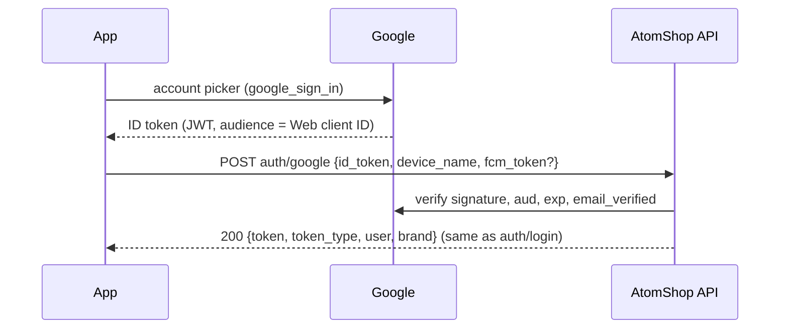

# Google sign-in and sign-up

> **Status (2026-10-02):** the app side of **sign-in** is built (the "Continue with Google" button on Welcome and Sign in). It needs (1) Google Cloud credentials and (2) the `auth/google` endpoint on the server. **Sign-up** with Google is designed below but not built yet.

## 1. How it works



The app never sees a Google password and the server never stores a Google token. Google only proves which email the person controls; the server then finds the **brand** account with that email.

## 2. Google Cloud setup (one-time)

Do this in [Google Cloud Console](https://console.cloud.google.com/) with one project for AtomBrands.

1. **OAuth consent screen** (APIs & Services → OAuth consent screen)
   - User type: **External**. App name: **AtomBrands**. Support email: `atomshoppk@gmail.com`. Logo: the AB mark.
   - Authorised domain: `atomshop.pk`. Add the privacy policy and terms URLs.
   - Scopes: `openid`, `email`, `profile` only (no sensitive scopes, so no Google review is needed).
   - Click **Publish app**. While it's in "Testing", only listed test users can sign in.
2. **Web client** (Credentials → Create credentials → OAuth client ID → *Web application*), named "AtomBrands server"
   - Its **Client ID** is the token audience. The app sends it as `GOOGLE_SERVER_CLIENT_ID`, and the server checks it.
   - The client secret isn't needed for ID-token verification. Keep it out of the app.
3. **Android client** (*Android*)
   - Package name: `pk.atomshop.atombrand_app`
   - SHA-1: add one client for each signing key:

     | Key | SHA-1 |
     |---|---|
     | Debug (this PC's `~/.android/debug.keystore`) | `A4:11:16:DB:0C:59:F2:65:E1:74:60:AB:2D:93:DA:A2:6E:E0:7D:13` |
     | Release upload key | from `keytool -list -v -keystore <release.jks>` |
     | Play App Signing | Play Console → Setup → App integrity |

   - The app doesn't use this client ID directly. Google uses the package name + SHA-1 to trust the app. **A missing SHA-1 is the most common reason sign-in fails** (it shows up as a "configuration" error).
4. **iOS client** (*iOS*), when iOS is built
   - Bundle ID: `pk.atomshop.atombrandApp`.
   - In `ios/Runner/Info.plist` add `GIDClientID` (the iOS client ID), `GIDServerClientID` (the Web client ID), and a URL type whose scheme is the **reversed** iOS client ID (`com.googleusercontent.apps.…`). Not done yet.

## 3. Running the app with Google enabled

```sh
flutter run --dart-define=GOOGLE_SERVER_CLIENT_ID=<web-client-id>.apps.googleusercontent.com
```
Without the define, the button shows "Google sign-in isn't set up in this version of the app yet." Add the same define to release builds and CI.

## 4. Server: `POST auth/google` (sign-in)

🔓 public, same rate limit as `auth/login` (10/min per IP).

| Field | Rules |
|---|---|
| `id_token` | required, string |
| `device_name` | optional, max 100 |
| `fcm_token` | optional |

**Steps**
1. Verify the token. Either:
   - with `google/apiclient`: `(new Google\Client(['client_id' => config('services.google.web_client_id')]))->verifyIdToken($idToken)`, or
   - by calling `GET https://oauth2.googleapis.com/tokeninfo?id_token=…` (fine at this volume).
2. Reject unless **all** of these hold, answering **422** "Google sign-in failed. Please try again." otherwise:
   - `aud` equals the Web client ID;
   - `iss` is `accounts.google.com` or `https://accounts.google.com`;
   - `exp` is in the future;
   - `email_verified` is true.
3. `User::where('role', 'brand')->where('email', $claims['email'])->first()`. If there's none, answer **401** "No AtomBrands account uses this Google email. Sign in with your password, or contact AtomShop to update your email." Use the same message for every "not found" case, so the endpoint doesn't reveal which emails exist.
4. Run the **same checks as `auth/login`** (`accountProblem()` → 403 for blocked / no brand linked).
5. Optional: store `sub` (Google's stable user ID) on the user to link the account, and stop email-only matching once it's linked. That needs a `google_id` column, which is a migration.
6. Issue the Sanctum token exactly as `auth/login` does, and return the same body: `{token, token_type, user, brand}`. Register `fcm_token` the same way.

**What the app shows**

| Server answer | App |
|---|---|
| 200 | Signs in, goes to Home |
| 401 / 403 | The server's `message` as a toast |
| 404 (endpoint missing) | "Google sign-in isn't available yet. Please sign in with your password." |
| 422 / 429 / network | Standard error toast |

> ⚠️ **Placeholder emails.** Many brand accounts use `…@atomshop.pk` placeholder emails. Google can never match those, so those brands must have their **real** email set on their account first.

## 5. Sign-up with Google (proposed, not built)

There is no self sign-up: a new brand **applies** and AtomShop creates the account after review (BRAND_APP.md §6.3). Google speeds up the application and lets the brand sign in with Google straight after approval.

**App flow**
1. Become a partner → new **"Continue with Google"** button above the form.
2. Google picker → prefill **Your name** and **Email** from the Google account, and lock the email field ("Verified with Google"; tap to change, which drops the Google link).
3. The partner fills in the rest. The phone is **still verified by WhatsApp code**, because AtomShop needs a reachable mobile.
4. `POST apply {…form, otp, google_id_token}`.

**Server changes to `apply`**
- New optional field `google_id_token`. Verify it as in §4 and require the token's email to equal the submitted `email`.
- Mark the application's email as verified, so the admin knows it's real.
- On approval, create the brand user with that email and `email_verified_at` set (and `google_id` if linked). The brand can then use **Continue with Google** right away, and the temporary-password email becomes optional.

**Errors**
- Google email ≠ submitted email → 422 on `email`: "Use the email of the Google account you chose, or remove the Google link."
- An application or account already uses that email → the existing duplicate-guard 422.

## 6. Checklist

**Google Cloud**
- [ ] Publish the consent screen.
- [ ] Create the Web client and share its ID with the app and the server.
- [ ] Create Android clients for the debug, release and Play signing SHA-1s.
- [ ] Create the iOS client, and update Info.plist (when iOS ships).

**Server**
- [ ] Add `services.google.web_client_id` to config/.env.
- [ ] Build `POST auth/google` with the tests from §4: valid token, wrong `aud`, expired token, unverified email, unknown email, blocked account.
- [ ] Set real emails on existing brand accounts that only have placeholders.
- [ ] (Sign-up) Accept `google_id_token` on `apply`.

**App**
- [ ] Pass `GOOGLE_SERVER_CLIENT_ID` in run configs and CI.
- [ ] (Sign-up) Add the Google button and prefill to the Apply screen.
